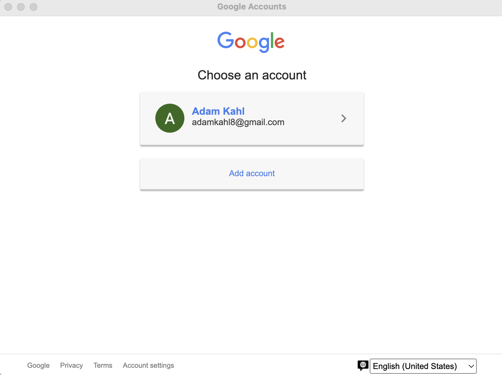

# Harmony User Guide

![Harmony Logo - Add screenshot here]

## Table of Contents
- [Introduction](#introduction)
- [Release Page](#release-page)
- [Installation](#installation)
    - [For Windows](#for-windows)
    - [For macOS](#for-macos)
- [Getting Started](#getting-started)
    - [Login Page](#login-page)
    - [Connecting Music Services](#connecting-music-services)
- [Managing Playlists](#managing-playlists)
    - [Viewing Playlists](#viewing-playlists)
    - [Transferring Playlists](#transferring-playlists)
- [Social Features](#social-features)
    - [Adding Friends](#adding-friends)
    - [Managing Friend Requests](#managing-friend-requests)
- [Notifications](#notifications)
    - [Types of Notifications](#types-of-notifications)
    - [Managing Notifications](#managing-notifications)
- [User Settings](#user-settings)
    - [Profile Information](#profile-information)
    - [Managing Connected Services](#managing-connected-services)
- [Troubleshooting](#troubleshooting)

## Introduction
Welcome to Harmony, your cross-platform solution for managing and sharing music playlists across different streaming services. Harmony seamlessly connects with Spotify and Apple Music, enabling you to transfer playlists between platforms and share them with friends.

## Release Page
The latest version of Harmony can be downloaded from the GitHub Releases page. Here you'll find versions for Windows, macOS, and Linux.

## Installation

### For Windows
1. Navigate to the Harmony releases page
2. Download the latest .exe file
3. Once downloaded, double-click the executable file
4. Follow the on-screen installation prompts
5. After installation, Harmony will appear in your Start menu

### For macOS
1. Navigate to the Harmony releases page
2. Download the latest .dmg file
3. Once downloaded, double-click the DMG file to open it
4. Drag the Harmony application to your Applications folder
5. If you receive a security warning, go to System Preferences > Security & Privacy and click "Open Anyway"
6. Launch Harmony from your Applications folder

## Getting Started

### Login Page
When you first launch Harmony, you'll be presented with the login page.

**Sign in with Google:** Click the "Sign in with Google" button to authenticate using your Google account. This step is required before you can use the app.

After signing in with Google, you'll have the option to connect your music services.

### Connecting Music Services

- **Connect Spotify:** Click the "Connect Spotify" button to link your Spotify account. You'll be redirected to Spotify's login page.
- **Connect Apple Music:** Click the "Connect Apple Music" button to link your Apple Music account. You'll be redirected to Apple's authentication page.

Once you've connected at least one music service, click "Continue to App" to proceed to the main interface.

> **Note:** You can use Harmony with just one music service connected, but to transfer playlists between services, you'll need to connect both.

## Managing Playlists

### Viewing Playlists
The main interface of Harmony shows your playlists from connected music services in the sidebar.

![Main Interface - Add screenshot here]

- **Spotify Playlists:** Click on the Spotify dropdown to view all your Spotify playlists
- **Apple Music Playlists:** Click on the Apple Music dropdown to view all your Apple Music playlists
- **Select a playlist:** Click on any playlist to view its details and tracks in the main content area

### Transferring Playlists
Harmony allows you to transfer playlists between Spotify and Apple Music.

![Transfer Dialog - Add screenshot here]

1. Select a playlist you want to transfer by clicking on it
2. Click the Transfer button at the top of the playlist details view
3. In the transfer dialog, select your destination (Spotify or Apple Music)
4. Click Transfer to begin the process
5. A progress indicator will appear during the transfer
6. When complete, you'll receive a notification with the results

> **Note:** Some songs may not successfully transfer if they can't be found on the destination platform. You'll receive a detailed report in the notification.

## Social Features

### Adding Friends
Harmony allows you to connect with friends to share playlists.

![Friends Page - Add screenshot here]

1. Click on your profile picture in the top-right corner and select Friends
2. In the Friends page, use the Find Friends search box to search for users by email
3. When you find a user, click the Connect button to send them a friend request
4. The user will receive a notification about your request

### Managing Friend Requests
When someone sends you a friend request, you'll receive a notification.

![Friend Requests - Add screenshot here]

1. Click the Notifications bell icon in the top-right corner to view notifications
2. Friend requests will appear with Accept and Deny buttons
3. Click Accept to add the person as a friend or Deny to reject the request
4. Once accepted, the user will appear in your friends list

## Notifications

### Types of Notifications
Harmony has a notification system that keeps you informed about various activities:

![Notifications Panel - Add screenshot here]

- **Friend Requests:** Notifications when someone sends you a friend request
- **Transfer Results:** Detailed reports when playlists are transferred
- **System Messages:** Important app updates or information

### Managing Notifications
1. Click the Bell icon in the top-right corner to open the notifications panel
2. Unread notifications appear highlighted
3. Click on a notification to mark it as read
4. Use the Mark All as Read button to clear all notifications
5. Click Show All Notifications to view your complete notification history

## User Settings

### Profile Information
To view and manage your profile:

![User Info Page - Add screenshot here]

1. Click your profile picture in the top-right corner and select User Info
2. Here you can view your:
     - Display name
     - Email address
     - Account creation date
     - Connected services

### Managing Connected Services
From the User Info page, you can see which music services are connected:

![Connected Services - Add screenshot here]

- If a service is not connected, you can connect it by clicking the corresponding button

## Troubleshooting
If you encounter issues with Harmony:

- **Authentication Problems:** Try signing out and signing back in
- **Playlist Transfer Failures:** Check if the songs exist on both platforms
- **Connection Issues:** Verify your internet connection
- **Service Integration:** Make sure your Spotify or Apple Music subscriptions are active
- **App Performance:** Restart the application if it becomes slow or unresponsive

For additional support, please visit our GitHub repository and open an issue.

Thank you for using Harmony! We hope this guide helps you make the most of your cross-platform music experience.